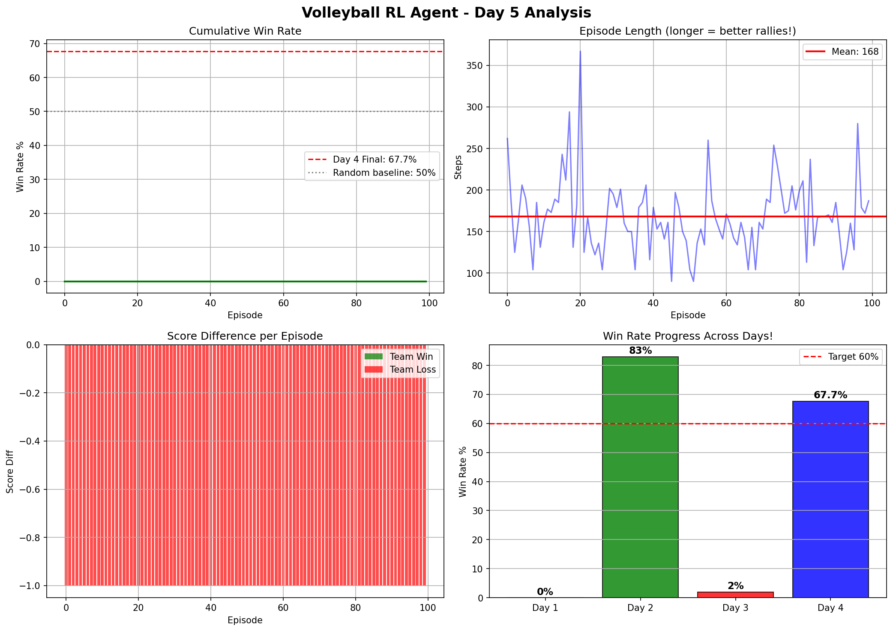
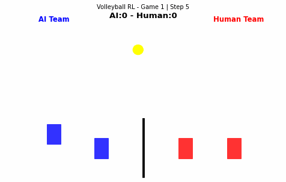

# 🏐 Volleyball RL — Multi-Agent Reinforcement Learning

## Live Demo
👉 https://huggingface.co/spaces/22BCS13912/volleyball-rl-game

## Project Results
| Day | Feature | Result |
|-----|---------|--------|
| Day 1 | Custom Environment + PPO | Agent hits ball |
| Day 2 | Smarter Reward Function | 83% win rate 1v1 |
| Day 3 | 2v2 Multi-Agent Framework | Team play |
| Day 4 | Single Brain 2v2 | 67.7% win rate |
| Day 5 | Training Analysis | Full visualization |
| Day 6 | Human vs AI GIF | Gameplay demo |
| Day 8 | Self-Play Training | AlphaGo technique |
| Day 9 | Curriculum Learning | 4 difficulty levels |
| Day 10 | Streamlit Web App | Live demo |
| Day 11 | Hugging Face Deploy | World can play! |

## Key Features
- PPO algorithm with custom reward shaping
- 2v2 Multi-Agent RL with single brain approach
- Self-play training (same as AlphaGo and OpenAI Five!)
- Curriculum learning across 4 difficulty levels
- 3-touch Pass->Set->Spike volleyball logic
- Live deployment on Hugging Face

## Tech Stack
- Python 3
- Stable-Baselines3 (PPO)
- Gymnasium
- PyTorch
- Matplotlib
- Gradio

## Reward Function Design
```python
reward += 3.0    # hitting the ball
reward += 15.0   # hitting toward opponent side
reward += rally * 0.5  # longer rallies bonus
reward += 0.5    # positioning near ball
reward -= 0.5    # both agents chasing same ball
reward += 0.2    # defender staying back
```

## Training Progress


## Gameplay Demo


## Author
Jayaprakash Reddy G
- GitHub: github.com/prakash22bcs13912
- LinkedIn: linkedin.com/in/jayaprakashgopavaram
- Live Demo: huggingface.co/spaces/22BCS13912/volleyball-rl-game
- Research: NLP-Based Sentiment Analysis for Urban Flood Relief
